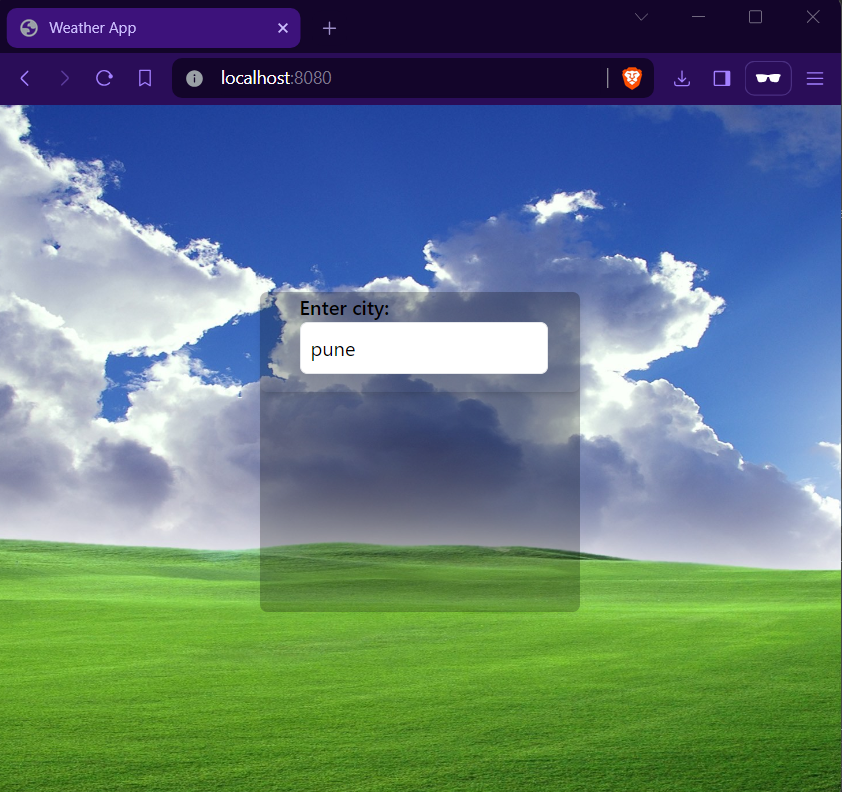

# Weather App


## Description

* The Weather App is a simple web application that allows users to check the current weather conditions for a given city. Users can enter the name of a city, and the app will display information such as temperature, weather condition, and an icon representing the weather.

## Getting Started

### Technologies used
* HTML/CSS
* JavaScript
* Spring Boot (for backend)
* Thymeleaf (for server-side templating)
* AccuWeather API (for weather data)
* Tailwind (for styling)


### Installing

* Clone the repository:
```
git clone https://github.com/your-username/weather-app.git
```

* Navigate to the project directory:
```
cd weather-app
```

* Build and run the project using Maven:
```
mvn spring-boot:run
```
* Open your web browser and visit http://localhost:8080 to access the Weather App.

### Usage

* Enter the name of a city in the search bar.
* Click on the search button or press Enter to view the current weather conditions for the specified city.
* The weather information, including temperature and weather description, will be displayed below the search bar.

##Screenshot
 
*Screenshot: Current weather conditions for Pune, India*

## Authors

Prashant Sonwani

## Version History
* 0.3
	* readme updated
* 0.2
    * Refactor code for improved readability and performance
    * Implement search functionality for cities
    * Update CSS styles for better user experience
* 0.1
    * Initial Release
